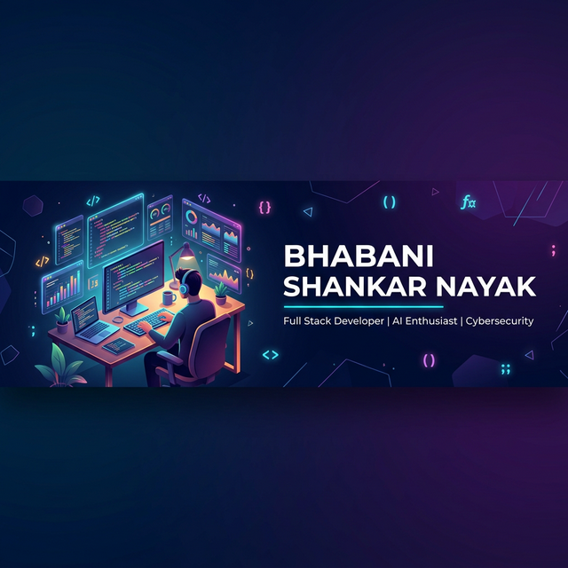

<p align="center">
  
</p>

<h1 align="center">
  
</h1>

<p align="center">
  <a href="mailto:bsbhabani00@gmail.com"></a>
  <a href="https://github.com/BHABANISHANKAR-01"></a>
  
</p>

<p align="center">
  <i>"I'll Do What You Can't Do, And You Do What I Can't Do.<br/>Let's just make this world better."</i>
</p>

---

## 🧑‍💻 About Me

```yaml
name: Bhabani Shankar Nayak
role: Full Stack Developer | AI & ML Enthusiast | Cybersecurity Explorer
education: Currently mastering AI & Deep Learning
interests:
  - 🤖 Artificial Intelligence & Machine Learning
  - 🔐 Cybersecurity & Penetration Testing
  - 🌐 Full Stack Web Development
  - 📊 Data Science & Analytics
  - 🎮 Creative Side Projects
currently_working_on: AI-Powered Security Tools
open_to_collaborate: Deep Learning, Web Dev, Open Source
contact: bsbhabani00@gmail.com
```

---

## 🛠️ Tech Stack

<table align="center">
<tr>
<td align="center" width="25%">

**💻 Languages**

<br/>


</td>
<td align="center" width="25%">

**🧰 Frameworks**

<br/>


</td>
<td align="center" width="25%">

**🤖 AI / ML**

<br/>


</td>
<td align="center" width="25%">

**🔧 Tools**

<br/>


</td>
</tr>
</table>

---

## 🚀 Featured Projects

<table>
<tr>
<td width="50%">

### 🛡️ [AI Phishing Agent](https://github.com/BHABANISHANKAR-01/AIPhissingAgent)
> Autonomous AI-powered penetration testing assistant with Groq LLM integration


- 🤖 AI-driven scan planning & analysis
- 🔍 Network, Port, Web & Vuln scanning
- 🧪 Exploit verification lab with PoC
- 📊 Real-time SSE dashboard

</td>
<td width="50%">

### 📝 [Resume Enhancer](https://github.com/BHABANISHANKAR-01/ResumeEnhancer)
> AI-powered resume builder with professional templates & PDF export


- 🎨 Multiple professional templates
- 📄 One-click PDF export (A4 sized)
- ✨ Real-time preview
- 🎯 ATS-friendly formatting

</td>
</tr>
<tr>
<td width="50%">

### 🎯 [CareerCrafter](https://github.com/BHABANISHANKAR-01/CareerCrafter)
> ATS score predictor & resume customizer for job descriptions


- 📊 ATS score prediction
- 🔄 Resume-to-JD matching
- 💡 Smart improvement suggestions
- ⭐ 1 Fork

</td>
<td width="50%">

### 🔗 [Blockchain Visualiser](https://github.com/BHABANISHANKAR-01/blockchainvisualiser)
> Interactive blockchain visualization tool for understanding distributed ledger technology


- ⛓️ Visual block creation
- 🔐 Hash chain demonstration
- 📖 Educational tool
- 🎮 Interactive UI

</td>
</tr>
<tr>
<td width="50%">

### 🖐️ [Gesture Control](https://github.com/BHABANISHANKAR-01/GESTURE-CONTROLL-USING-PYTHON)
> Control PC music using hand gestures via OpenCV


- ✋ Real-time hand detection
- 🎵 Volume & playback control
- 📷 Computer vision powered
- ⭐ 1 Star · 1 Fork

</td>
<td width="50%">

### 🏏 [IPL 2025 Data Analysis](https://github.com/BHABANISHANKAR-01/IPL_2025_Data_Analysis_Project)
> Comprehensive data analysis of IPL 2025 season


- 📈 Statistical analysis
- 📊 Data visualization
- 🏆 Performance metrics
- 📋 Insights & trends

</td>
</tr>
</table>

<details>
<summary><b>📦 More Projects</b></summary>
<br/>

| Project | Description | Tech |
|:--------|:------------|:-----|
| [🌤️ Weather API](https://github.com/BHABANISHANKAR-01/Weather_API) | Weather information app using API | Python |
| [🩺 AyurMed](https://github.com/BHABANISHANKAR-01/AyurMed) | Ayurvedic medicine platform | Web Dev |
| [📚 Notes Sharing App](https://github.com/BHABANISHANKAR-01/notes-sharing-app) | Collaborative notes sharing platform | Full Stack |
| [🎓 Student Result System](https://github.com/BHABANISHANKAR-01/Student_Result_Management_System) | Web-based result management | Web Dev |
| [🚗 Self Driving Car](https://github.com/BHABANISHANKAR-01/Self-driving-car) | Autonomous driving simulation | Python |
| [🧮 Calculator](https://github.com/BHABANISHANKAR-01/CALCULATOR-USING-PYTHON) | Python GUI calculator | Python |
| [🌐 Chrome Clone](https://github.com/BHABANISHANKAR-01/Chrome-Clone) | Browser UI clone | HTML/CSS/JS |
| [📅 Class Schedule](https://github.com/BHABANISHANKAR-01/Classschedule) | Class timetable manager | Web Dev |
| [🎰 Roulette Wheel](https://github.com/BHABANISHANKAR-01/Roulette-Wheel) | Interactive roulette game | Web Dev |
| [🐍 Python Fullstack](https://github.com/BHABANISHANKAR-01/Python-Fullstack) | Python fullstack training repo | Python |
| [📕 ML HelpBook](https://github.com/BHABANISHANKAR-01/ML-HelpBook) | Machine learning reference notebook | ML |
| [📗 EbookPython](https://github.com/BHABANISHANKAR-01/EbookPython) | Detailed Python study guide | Python |
| [🎴 Profile Card](https://github.com/BHABANISHANKAR-01/profile-card) | Stylish profile card component | HTML/CSS |
| [🌐 Portfolio](https://github.com/BHABANISHANKAR-01/portfolio) | Personal portfolio website | Web Dev |

</details>

---

## 📊 GitHub Analytics

<p align="center">
  
  
</p>

<p align="center">
  
</p>

---

## 🏆 GitHub Trophies

<p align="center">
  
</p>

---

## 📈 Contribution Graph

<p align="center">
  
</p>

---

## 🐍 Contribution Snake

<p align="center">
  
</p>

---

<p align="center">
  
</p>

<p align="center">
  <b>💬 "Code is like humor. When you have to explain it, it's bad."</b>
  <br/><br/>
  
</p>
